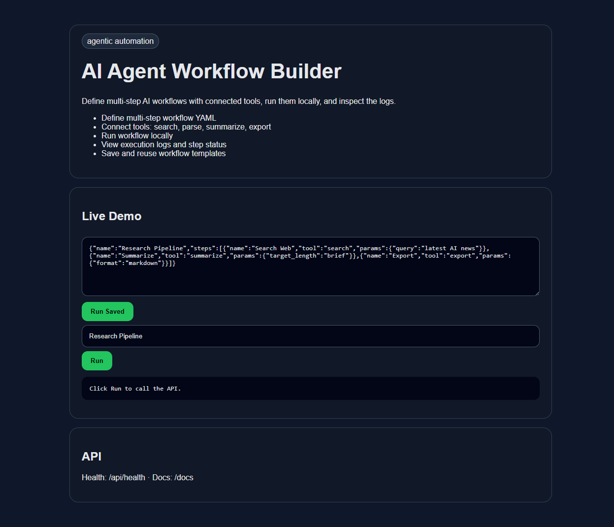

# AI Agent Workflow Builder

    

Define multi-step AI workflows with connected tools, run them locally, and inspect the logs.



## Features
- Define multi-step workflow YAML
- Connect tools: search, parse, summarize, export
- Run workflow locally
- View execution logs and step status
- Save and reuse workflow templates

## Quick Start

```bash
uv sync
uv run uvicorn src.main:app --reload --port 8109
```

Open: http://localhost:8109

## API
- `GET /` - browser demo
- `GET /api/health` - health check
- `GET /docs` - interactive FastAPI docs

## Verify
```bash
uv run pytest -q
```
